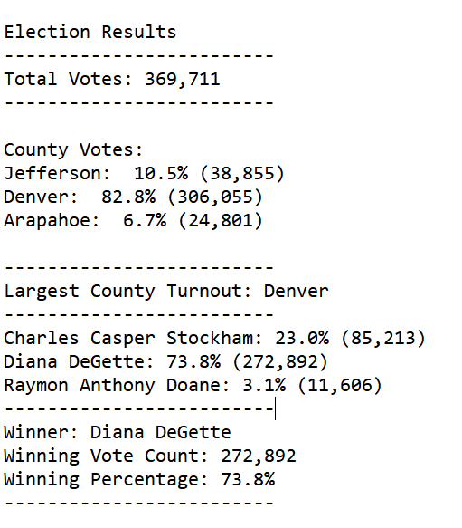

# Election Analysis

## Overview 
Use python code to conduct the election analysis and print the result of the election to file

1. calculate total number of votes
2. list the candidates with the votes and % of the votes they received
3. calculate which county has the highest voter turnout
4. determine the winner of the election with the vote counts and percentage

## Result

 

## Summary

The script used for this analysis can be easily modifed for future vote analysis to see the election results if the data are collected in the similar format as the election result.csv.